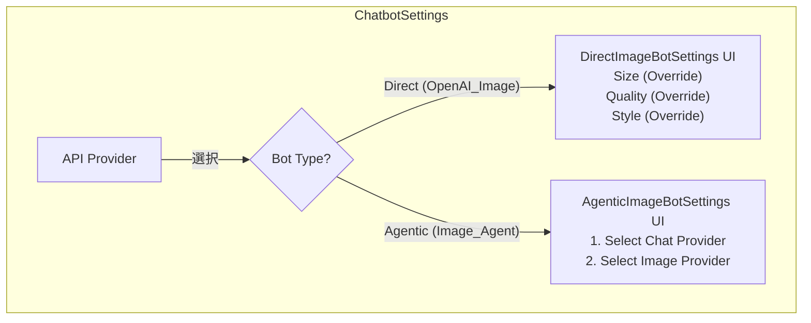

# 画像生成機能 実装計画 (最終版)

## 概要

Chatbot設定に「画像生成」機能を追加し、既存のチャットボットがTool-useを介して画像を生成できるようにする。

## アーキテクチャ

- **関心の分離**: チャット機能と画像生成機能を明確に分離する。
- **画像ジェネレーター**: 画像生成APIの認証情報や設定を「画像ジェネレーター」として独立して管理する。
- **Tool-use連携**: 各チャットボットの設定画面で、使用する「画像ジェネレーター」を紐付け、Toolとして画像生成機能を有効化する。

```mermaid
graph TD
    subgraph "設定画面 (Settings UI)"
        A[Chatbot設定画面] -- "どのGeneratorを使うか選択" --> B[画像Generator設定画面]
        B -- "GeneratorをCRUD" --> C["ユーザー設定 (UserConfig)"]
        A -- "Botごとに画像生成を有効化" --> C
    end

    subgraph "データモデル (user-config.ts)"
        C -- "保持する" --> D["ImageGenerator[]<br>(名前, APIキー, モデル等)"]
        C -- "保持する" --> E["CustomApiConfig<br>(各Botの設定)"]
        E -- "画像生成設定を持つ" --> F["imageToolBinding: { enabled, generatorId }<br>imageToolOverrides: { ... }<br>model: '...'"]
    end

    subgraph "実行フロー (Runtime Flow)"
        G[チャットUI] -- "メッセージ送信" --> H{チャットボット<br>(Image_Agent)}
        H -- "内部で生成" --> I[プロンプト生成Bot<br>(Claude/OpenAI)]
        I -- "Tool定義を付けてLLMにリクエスト" --> J[LLM API]
        J -- "tool_useを返す" --> I
        I -- "Tool Callを検知" --> K[ImageAgentWrapper]
        K -- "画像生成を依頼" --> L[image-tools.ts]
        L -- "設定に基づきアダプターに委譲" --> M[画像Providerアダプター]
        M -- "画像生成APIを叩く" --> N[外部画像API]
        N -- "画像" --> M
        M -- "Markdownを生成" --> K
        K -- "結果をUIに表示" --> G
    end

    style C fill:#f9f,stroke:#333,stroke-width:2px
```

### 実装後のアーキテクチャ / データフロー

#### データモデル

- `ProviderConfig` (`src/services/user-config.ts`)
  - `providerType`: `chat` / `image` / `chat-image`
  - `imageDialect`: `sd` / `novita` / `openai_responses` などの画像APIダイアレクト
- `CustomApiConfig`
  - `provider`: `CustomApiProvider`（ImageAgent 等）
  - `agenticImageBotSettings`: { `imageGeneratorProviderId`, `promptGeneratorBotIndex`, ... }
  - `imageGeneration`: Negative Prompt や Width 等のデフォルト値

#### 設定UI

1. **API Providers** (`ProviderEditModal.tsx`)
   - Provider Type と Image Scheme を設定
   - Provider 一覧にタイプ表示
2. **Individual Chatbot Settings** (`ChatbotSettings.tsx`)
   - 「API Provider」で `Image Generation (Agent)` を選択 → プロンプト生成Botと画像Providerを選ぶパネルを表示
   - Image Scheme override や Provider Params(JSON) を指定可能

#### 実行フロー

1. `CustomBot` が `CustomApiProvider.ImageAgent` の場合、`ImageAgentBot` を生成
2. `ImageAgentBot`（`src/app/bots/image-agent/index.ts`）
   - 設定から Prompt Generator Bot（Claudeなど）と Image Provider を取得
   - Claude Bot に `generate_image` ツール定義を `setTools` で注入し、system prompt にツール指示を追加
   - Claude とのストリームを監視し、`TOOL_CALL` イベントを受けたら設定された Provider のアダプタ（`generateWithChutes` / `generateWithNovita` 等）で画像生成
   - 生成後、Markdown 形式で UI へ `UPDATE_ANSWER` を送信し、`DONE` で終了
   - ツールが呼ばれない場合は Claude のテキスト応答をそのまま返却
3. Claude Bot 側 (`claude-api/index.ts`) は SSE を解析し `TOOL_CALL` を `ImageAgentBot` へ通知

#### アダプタ層 (`src/services/image-tools.ts`)

| アダプタ | 説明 |
|----------|------|
| `generateWithChutes` | Chutes API へ直接POSTし、生成画像の Data URL を返す |
| `generateWithNovita` | 非同期タスクAPIをポーリングして画像URLを返す |
| `IMAGE_GENERATION_TOOL_CLAUDE` | Claude 用の tool schema（`generate_image`） |

#### 拡張ポイント

- Provider 追加時に imageDialect を設定することで、今後 OpenAI Responses / OpenRouter Image などのアダプタを簡易に追加可能
- Provider Params(JSON) に任意のプロバイダ固有パラメータを記載し、ツール引数 → ボット設定 → Provider設定 の順で統合

## タスクリスト (完了済み)

1.  **データモデルの更新 (`src/services/user-config.ts`)**
    -   [x] `CustomApiProvider` から不要な画像生成関連のenumを削除。
    -   [x] `CustomApiConfig` から非推奨のプロパティを削除し、`imageToolBinding` と `imageToolOverrides` に一本化。
    -   [x] `ImageGenerator` インターフェースに `model` プロパティを必須項目として定義。
    -   [x] `ImageApiSettings` を簡素化。

2.  **画像ジェネレーター設定画面の実装**
    -   [x] `SettingPage.tsx` に「Image Generators」セクションを追加。
    -   [x] `ImageGeneratorSettings.tsx` と `ImageGeneratorEditModal.tsx` を作成し、`ImageGenerator` のCRUD UIを実装。

3.  **チャットボット設定画面の改修 (`src/app/components/Settings/ChatbotSettings.tsx`)**
    -   [x] `API Provider` で「AI画像生成」を選択した際の専用UIを実装。
        -   [x] **チャットボト選択**: プロンプト生成用のベースとなるチャットボットを選択するUIを実装。
        -   [x] **画像ジェネレーター選択**: 登録済みの画像ジェネレーターを選択するUIを実装。
        -   [x] **画像モデル**: 画像生成に使用するモデル名を入力するUIを実装。
        -   [x] **System Prompt追記**: プロンプト生成用ボットのSystem Promptに追記するUIを実装。
    -   [x] `Image_Agent` 選択時は、不要な設定項目（Temperatureなど）を非表示にするよう修正。

4.  **Bot実行ロジックの対応**
    -   [x] `custombot.ts`: `Image_Agent` の場合、`ImageAgentWrapperBot` を生成し、その際に `model` を含む画像生成関連の設定を正しく渡すように修正。
    -   [x] `image-agent-wrapper.ts`: `model` を受け取り、`generateImageViaToolFor` に渡すように修正。
    -   [x] `image-tools.ts`: `generateImageViaToolFor` が `model` を受け取り、各プロバイダーに渡すように修正。
    -   [x] `claude-api/index.ts`: ストリーミング処理を修正し、`tool_use` と `message_delta` イベントを正しくハンドリングするように改修。
    -   [x] `chutes.ts`, `seedream.ts`: Tool-useのスキーマに `description` を追加。

5.  **動作確認とテスト**
    -   [x] ビルドが通ることを確認し、関連するエラーをすべて修正。

---

## Phase 2: データモデルのリファクタリングとUI改善

### 背景

既存の実装では、`CustomApiConfig`内に画像生成関連の設定（`imageSize`, `imageQuality`など）が他の設定と混在しており、見通しが悪くなっている。また、今後の拡張（Agenticな画像生成など）を考慮すると、設定の構造が複雑化する可能性がある。

この問題を解決するため、データモデルをリファクタリングし、設定の関心を分離する。

### 設計方針

画像生成のパターンを以下の2種類に明確に分類し、それぞれに専用の設定インターフェースを設ける。

1.  **直接画像生成 (Direct Image Bot)**
    *   `OpenAI_Image`のように、単体で画像生成APIを直接呼び出すボット。
    *   設定項目: `size`, `quality`, `style`など。

2.  **Agentic画像生成 (Agentic Image Bot)**
    *   チャットモデルがユーザーの指示からプロンプトを生成し、内部的に画像生成ツールを呼び出すボット。
    *   設定項目: プロンプト生成用モデル、画像生成ツール、Agentの挙動に関する設定など。

### データモデル変更案 (`src/services/user-config.ts`)

以下の通り、`CustomApiConfig`をリファクタリングし、関連するインターフェースを新設する。

```typescript
/**
 * パターン1：直接画像生成ボット用の設定
 * (例: OpenAI DALL-E, Stable Diffusionなどを直接呼び出すボット)
 */
export interface DirectImageBotSettings {
  size?: 'auto' | '1024x1024' | '1024x1536' | '1536x1024';
  quality?: 'auto' | 'standard' | 'hd'; // 'hd' は DALL-E 3向け
  style?: 'auto' | 'vivid' | 'natural'; // DALL-E 3向け
}

/**
 * パターン2：Agentic画像生成ボット用の設定
 * (チャットモデルがプロンプトを生成し、画像生成ツールを呼び出す)
 */
export interface AgenticImageBotSettings {
  // プロンプトを生成するチャットモデルのProvider ID
  promptGeneratorProviderId: string;
  // 画像を生成するツールのProvider ID
  imageGeneratorProviderId:string;
  // Agentの挙動を制御する設定
  autoEnhancePrompts?: boolean;
  includeRevisedPrompt?: boolean;
}

/**
 * Chatbotごとの設定を持つメインのインターフェース
 */
export interface CustomApiConfig {
  id: string;
  name: string;
  provider: string;
  // ...温度設定などの既存フィールド

  // --- リファクタリング対象 ---
  // 以下の散在したフィールドは廃止し、新しいインターフェースに移行する
  // imageSize?: ...
  // imageQuality?: ...

  /** [パターン1] 直接画像生成ボット向けの設定 */
  directImageBotSettings?: DirectImageBotSettings;

  /** [パターン2] Agentic画像生成ボット向けの設定 */
  agenticImageBotSettings?: AgenticImageBotSettings;
}
```

### UI設計と連携

データモデルの変更に伴い、設定UIも以下のように改修する。

#### 1. API Provider設定画面の拡張 (`ApiProviderSettings.tsx`, `ProviderEditModal.tsx`)

画像生成機能を持つプロバイダーを「Image Provider」として一元管理する。

-   **Provider Typeの導入**: `ProviderEditModal`に`Provider Type`（`Chat` / `Image`）を追加。
-   **専用設定UI**: `Image`を選択した場合、`DirectImageBotSettings`に対応するデフォルト設定（`Size`, `Quality`, `Style`）を入力できるようにする。

```mermaid
graph TD
    subgraph ProviderEditModal
        A[Provider Type] -- "選択" --> B{Image?}
        B -- Yes --> C[Image Provider専用設定<br>- Default Size<br>- Default Quality<br>- Default Style]
        B -- No --> D[Chat Provider設定<br>(既存のUI)]
    end
```

#### 2. Chatbot設定画面の改修 (`ChatbotSettings.tsx`)

ボットの種類に応じて、動的にUIを切り替える。

-   **直接画像生成ボットの場合**:
    -   `API Provider`で`OpenAI_Image`などを選択。
    -   `directImageBotSettings`に対応するUIを表示。
    -   設定項目には、関連付けられたImage Providerのデフォルト値をプレースホルダーとして表示し、ボットごとに上書き（Override）できるようにする。

-   **Agentic画像生成ボットの場合**:
    -   `API Provider`で`Image_Agent`を選択。
    -   `agenticImageBotSettings`に対応するUIを表示。
    -   プロンプト生成用の「Chat Provider」と、画像生成用の「Image Provider」をそれぞれ選択するドロップダウンを表示する。



### 実装タスクリスト (Phase 2)

1.  **データモデルの更新 (`src/services/user-config.ts`)**
    -   [ ] `DirectImageBotSettings` および `AgenticImageBotSettings` インターフェースを定義する。
    -   [ ] `CustomApiConfig` から既存の画像関連フィールドを削除し、上記の新しいインターフェースへの参照を追加する。

2.  **設定移行ロジックの実装**
    -   [ ] アプリケーション起動時に、古い形式の `CustomApiConfig` を新しい形式に変換するマイグレーション処理を実装する。(`user-config.ts`内)

3.  **設定UIの改修**
    -   [ ] `ProviderEditModal.tsx`: `Provider Type`を追加し、Image Provider用のデフォルト設定UIを実装する。
    -   [ ] `ChatbotSettings.tsx`: ボットの種類に応じて`directImageBotSettings`または`agenticImageBotSettings`のUIを動的に表示するように修正する。

4.  **Bot実行ロジックの改修**
    -   [ ] `custombot.ts`: `directImageBotSettings` / `agenticImageBotSettings` から設定を読み取り、各ボットに渡すように修正する。
    -   [ ] `openai-image/index.ts` 等の直接画像生成ボットが、新しい設定オブジェクトを受け取るように修正する。

5.  **Agentic画像生成の実装**
    -   [x] `agenticImageBotSettings` に基づくUIと実行ロジック（Claude tool_use を経由）を実装済み。
        - `ChatbotSettings.tsx` で Image Agent 専用UIを提供。
        - `ImageAgentBot` で tool_call を捕捉し、設定されたプロバイダー経由で画像生成。

---

## Phase 3: Tool-use ベースの Image Agent 実装 (現在の実装)

### 実装アーキテクチャ

#### 1. Tool Definition (`src/services/image-tools.ts`)

Claude API 用の Tool 定義を作成：

```typescript
export const IMAGE_GENERATION_TOOL_CLAUDE = {
  name: 'generate_image',
  description: 'Generate an image based on a text prompt. Use this when the user asks to create, generate, or make an image.',
  input_schema: {
    type: 'object',
    properties: {
      prompt: { type: 'string', description: 'A detailed description of the image to generate' },
      negative_prompt: { type: 'string', description: 'Things to avoid in the image' },
      width: { type: 'number', default: 1024 },
      height: { type: 'number', default: 1024 },
      steps: { type: 'number', default: 20 },
      guidance_scale: { type: 'number', default: 7.5 },
      seed: { type: 'number' }
    },
    required: ['prompt']
  }
}
```

#### 2. ClaudeApiBot の拡張 (`src/app/bots/claude-api/index.ts`)

**追加した機能:**

1. **Tools パラメータのサポート**
   - `config.tools` を追加
   - `setTools(tools: any[])` メソッドを追加
   - API リクエスト body に `tools` フィールドを含める

2. **Tool Use イベントのストリーミング処理**
   ```typescript
   // content_block_start で tool_use を検知
   if (data.type === 'content_block_start' && data.content_block?.type === 'tool_use') {
     currentToolUse = { id: data.content_block.id, name: data.content_block.name, input: '' }
   }

   // input_json_delta で引数を累積
   if (data.type === 'content_block_delta' && data.delta?.type === 'input_json_delta') {
     currentToolUse.input += data.delta.partial_json || ''
   }

   // content_block_stop で Tool Call を emit
   if (data.type === 'content_block_stop' && currentToolUse) {
     const input = JSON.parse(currentToolUse.input)
     params.onEvent({
       type: 'TOOL_CALL',
       data: { id: currentToolUse.id, name: currentToolUse.name, arguments: input }
     })
   }
   ```

#### 3. Event 型の拡張 (`src/app/bots/abstract-bot.ts`)

新しいイベントタイプ `TOOL_CALL` を追加：

```typescript
export type Event =
  | { type: 'UPDATE_ANSWER', data: AnwserPayload }
  | { type: 'DONE' }
  | { type: 'ERROR', error: ChatError }
  | { type: 'TOOL_CALL', data: { id: string, name: string, arguments: any } }
```

#### 4. ImageAgentBot の実装 (`src/app/bots/image-agent/index.ts`)

**動作フロー:**

```
User: "Generate a cat on the beach"
   ↓
ImageAgentBot.doSendMessage()
   ↓
1. 設定から Image Provider と Prompt Generator Bot を取得
   ↓
2. Prompt Generator Bot (Claude) を createBotInstance() で生成
   ↓
3. setTools([IMAGE_GENERATION_TOOL_CLAUDE]) で Tool 定義を注入
   ↓
4. setSystemMessage() で「画像生成ツールを使うべき」という指示を追加
   ↓
5. Claude に doSendMessage() でリクエスト（Event をラップ）
   ↓
6. Claude が tool_use を返す → TOOL_CALL イベント発火
   ↓
7. ImageAgentBot が TOOL_CALL を捕捉
   ↓
8. arguments から prompt/width/height 等を取得
   ↓
9. Image Provider の dialect に基づき generateWithChutes() or generateWithNovita() を呼び出し
   ↓
10. 画像 URL/Data URL を取得
   ↓
11. Markdown 形式で UPDATE_ANSWER イベントを emit
   ↓
12. DONE イベントを emit
```

**重要な実装ポイント:**

```typescript
// Tool を注入
if (typeof (promptBot as any).setTools === 'function') {
  (promptBot as any).setTools([IMAGE_GENERATION_TOOL_CLAUDE])
}

// System Prompt を拡張
const toolInstruction = `
You have access to an image generation tool called 'generate_image'.
When the user asks you to create, generate, make, or show an image,
you MUST use this tool.`
(promptBot as any).setSystemMessage(originalSystemMessage + toolInstruction)

// Event をラップして TOOL_CALL を捕捉
const wrappedParams = {
  ...params,
  onEvent: async (event: Event) => {
    if (event.type === 'TOOL_CALL') {
      // 画像生成処理
      const imageUrl = await generateWithChutes(...)
      params.onEvent({
        type: 'UPDATE_ANSWER',
        data: { text: `` }
      })
      params.onEvent({ type: 'DONE' })
    } else {
      params.onEvent(event) // 他のイベントはそのまま転送
    }
  }
}
```

#### 5. UI の実装 (`src/app/components/Settings/ChatbotSettings.tsx`)

**API Provider ドロップダウンに Image Agent を追加:**

```typescript
const options = [
  { name: t('Individual Settings'), value: 'individual' },
  { name: '🤖 Image Agent', value: '__image_agent__' },  // ← 2番目に配置
  ...providers.map(p => ({ name: p.name, value: p.id, icon: p.icon }))
]
```

**Image Agent 選択時の専用 UI:**

```typescript
{config.provider === CustomApiProvider.ImageAgent && (
  <div className="bg-blue-50 dark:bg-blue-900/20 border border-blue-200 rounded-lg p-4">
    <p>📦 Image Generation Settings</p>

    {/* Image Provider 選択 */}
    <Select
      options={getImageProviders(userConfig.providerConfigs || [])}
      value={config.agenticImageBotSettings?.imageGeneratorProviderId || ''}
      onChange={(v) => { /* agenticImageBotSettings を更新 */ }}
    />

    {/* Prompt Generator Bot 選択 */}
    <Select
      options={[
        { name: 'None (Use raw prompt)', value: '-1' },
        ...customApiConfigs.filter((_, i) => i !== index)
      ]}
      value={config.agenticImageBotSettings?.promptGeneratorBotIndex}
      onChange={(v) => { /* agenticImageBotSettings を更新 */ }}
    />
  </div>
)}
```

**Advanced Settings の調整:**

- Image Agent の場合、API Host と API Key は非表示（Image Provider で設定するため）
- AI Model ラベルを「画像モデル」に変更

### 現在の制限事項

1. **対応モデル**
   - ✅ Claude (Anthropic API)
   - ❌ OpenAI (GPT) - 未実装
   - ❌ その他のモデル

2. **対応画像 Provider**
   - ✅ Chutes AI (`sd` dialect)
   - ✅ Novita AI (`novita` dialect)
   - ❌ OpenAI DALL-E
   - ❌ OpenRouter Image

3. **Tool Result の返却**
   - 現在は Tool Call を受けて画像を生成するが、Claude API に `tool_result` を返していない
   - マルチターン会話での Tool 使用には対応が必要

### デバッグ情報

**Console ログで確認すべきポイント:**

1. `[ImageAgent] Called setTools on promptBot` - Tool 注入成功
2. `[ClaudeApiBot] setTools called with:` - Tool 定義受信
3. `[ClaudeApiBot] Full request body:` - API リクエスト全体（`tools` が含まれているか確認）
4. `claude sse message` - Claude からのストリーム
5. `tool_use` イベント - Tool Call の検知

### 既知の問題

**Issue #1: Tools が API リクエストに含まれない**
- 症状: `body.tools` を設定しても、実際の fetch リクエストに含まれていない
- 調査中: `console.log('[ClaudeApiBot] Full request body:', ...)` で確認

**Issue #2: 最初のメッセージでネットワークリクエストが作られない**
- 症状: 初回メッセージ送信時にリクエストが発行されない
- 原因不明、要調査

### 次のステップ

1. **Claude API への Tool 送信を修正**
   - `body.tools` が実際に送られない問題を解決

2. **Tool Result の実装**
   - 画像生成後、`tool_result` を Claude に返して会話を継続

3. **OpenAI サポート追加**
   - `ChatGPTApiBot` に `tools` パラメータを追加
   - `function_call` のストリーミング処理を実装
   - `IMAGE_GENERATION_TOOL_OPENAI` を作成

4. **エラーハンドリング改善**
   - Image Provider 未設定時のエラーメッセージ
   - Tool Call タイムアウト処理
